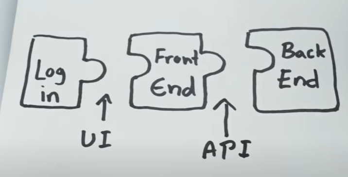

# Awesome API Resource

An API, or Application Programming Interface, is a set of rules, protocols, and tools that allows different software applications to communicate and interact with each other. APIs define the methods and data structures that developers can use to request and exchange information between various software components, services, or systems. APIs are used to enable the integration of different applications, enhance functionality, and streamline development processes. Here's a comprehensive overview of APIs:

**1. Purpose of APIs:**
   - **Interoperability:** APIs enable different software systems to work together by providing a standardized way to exchange information.
   - **Abstraction:** APIs hide the complexity of underlying processes and expose only the necessary functionalities to developers.
   - **Modularity:** APIs allow applications to be built in a modular manner, where each component can be developed independently and interact with others through well-defined interfaces.

**2. Types of APIs:**
   - **Web APIs:** These APIs are designed to be used over the internet and are accessible through HTTP or HTTPS protocols. Examples include RESTful APIs and GraphQL APIs.
   - **Library or Framework APIs:** These are APIs provided by libraries or frameworks that developers use to build software. They offer pre-defined functions and classes to simplify development.
   - **Operating System APIs:** These APIs provide a way for applications to interact with the underlying operating system, accessing resources like file systems, hardware, and system services.
   - **Third-party APIs:** Created by external developers or companies, these APIs allow developers to access the functionality of external services, platforms, or data sources. Examples include social media APIs (Twitter, Facebook), payment gateway APIs (PayPal, Stripe), and mapping APIs (Google Maps).

**3. Key Concepts:**
   - **Endpoints:** Specific URLs or URIs that represent various functions or resources provided by a web API.
   - **HTTP Methods:** Commonly used methods in web APIs are GET (retrieve data), POST (create data), PUT (update data), and DELETE (remove data).
   - **Request and Response:** APIs use requests to send data to a server and receive responses with requested data or outcomes.
   - **Authentication and Authorization:** Many APIs require authentication to ensure secure access, often using API keys, tokens, or OAuth protocols.
   - **Rate Limiting:** APIs often implement rate limits to prevent abuse and ensure fair usage by limiting the number of requests a user or application can make within a specific time frame.

**4. How do APIs work?**

API architecture is usually explained in terms of client and server. The application sending the request is called the client, and the application sending the response is called the server. So in the weather example, the bureau’s weather database is the server, and the mobile app is the client. There are four different ways that APIs can work depending on when and why they were created.

- **SOAP APIs:** Use Simple Object Access Protocol. Client and server exchange messages using XML. This is a less flexible API that was more popular in the past.
- **RPC APIs:** Are called Remote Procedure Calls. The client completes a function (or procedure) on the server, and the server sends the output back to the client.
- **Websocket APIs:** Uses JSON objects to pass data. It supports two-way communication between client apps and the server. The server can send callback messages to connected clients, making it more efficient than REST API.
- **REST APIs:** These are the most popular and flexible APIs found on the web today. The client sends requests to the server as data. The server uses this client input to start internal functions and returns output data back to the client. Let’s look at REST APIs in more detail below.

**4. API Documentation:**
   - Comprehensive documentation is crucial for developers to understand how to use an API effectively. It includes information about endpoints, methods, request/response formats, authentication methods, error handling, and usage examples.

**5. RESTful APIs and GraphQL:**
   - **REST (Representational State Transfer):** A popular architectural style for designing networked applications. It emphasizes a stateless, client-server interaction and uses HTTP methods to perform CRUD (Create, Read, Update, Delete) operations.
   - **GraphQL:** A query language and runtime for APIs that allows clients to request specific data and shape responses according to their needs. It reduces over-fetching and under-fetching of data.

**6. API Development:**
   - Developers can create APIs using various programming languages and frameworks.
   - Modern API development often involves creating endpoints that respond with JSON or XML data.

**7. API Lifecycle:**
   - **Design:** Plan the API's structure, endpoints, data models, and functionality.
   - **Development:** Write the code that implements the API's functionality.
   - **Testing:** Thoroughly test the API for correctness, security, and performance.
   - **Deployment:** Make the API accessible on a server or cloud platform.
   - **Maintenance:** Continuously monitor and update the API to fix bugs, add features, and ensure security.

**8. Future Trends:**
   - **API Security:** As APIs become more critical for application interactions, enhancing API security and protecting against vulnerabilities is essential.
   - **Microservices Architecture:** APIs play a crucial role in microservices-based architectures, where applications are built as a collection of loosely coupled services.
   - **Serverless Computing:** Serverless platforms utilize APIs extensively to connect and orchestrate functions as a service (FaaS).

In summary, APIs are a foundational technology for enabling communication and interaction between different software components, systems, and services. They facilitate innovation by allowing developers to leverage existing functionalities and integrate various services to create more complex and feature-rich applications.

**9. Image References**
